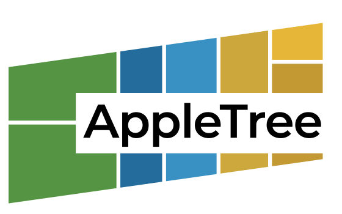

A fast disk usage visualizer for macOS, inspired by [WinDirStat](https://windirstat.net/) and [WizTree](https://diskanalyzer.com/), and forked from MacDirStat.

## Features

- **Cushion-shaded treemap** with zoom, shrink, file labels, folder depth controls, and multiple color palettes
- **Sortable directory table** with collapsible rows, keyboard navigation, resizable/reorderable columns, file icons, and persistent preferences
- **Scope-based scanning** for common locations, mounted volumes, custom folders, or multiple selected paths
- **Fast macOS scanning** using `getattrlistbulk`, `openat()`, cancellable background workers, and parallel tree building via rayon
- **Stable extension colors** so file types keep consistent treemap colors within a scan
- **File actions** from the table or treemap: open, reveal in Finder, copy path, and delete with native macOS confirmation

## Screenshot


## Building

Requires Rust with 2024 edition support. AppleTree is macOS-only and uses platform-specific APIs for scanning, dialogs, Finder integration, and packaging.

```sh
cargo build --release
```

## Packaging

Build a native macOS app bundle:

```sh
scripts/package-macos-app.sh
```

The bundle is written to `target/release/macos/AppleTree.app` and ad-hoc signed
by default. Set `CODESIGN_IDENTITY` to use a Developer ID certificate, or
`CODESIGN=0` to skip signing.

The app icon is built from `AppIcon.png`/`AppIcon.icns`. If the source icon changes, regenerate both files with:

```sh
scripts/prepare-macos-icon.sh
```

## Usage

```sh
# Launch to the scan scope interface
cargo run --release

# Scan a specific directory
cargo run --release -- /path/to/scan
```

Use the scope panel to select standard locations, mounted volumes, or custom folders. Nested selections are normalized so a child folder is not scanned twice when its parent is also selected. While a scan is running, it can be cancelled; if a previous scan was loaded, the app returns to it.

Keyboard shortcuts:

- `Delete` or `Backspace`: delete the selected item after confirmation
- `Shift+Delete` or `Shift+Backspace`: delete the selected item without confirmation
- `Enter`: open the selected item
- Arrow keys: move through and expand/collapse the table

## Benchmarking

```sh
# Scan throughput
cargo run --release --bin bench -- scan "$HOME" --runs 5 --warmups 1

# Table sort cost
cargo run --release --bin bench -- table-sort "$HOME" --sort name --asc

# Treemap layout and cushion render cost
cargo run --release --bin bench -- treemap-render "$HOME" --width 1200 --height 800
```

## How it works

AppleTree scans directories using the macOS `getattrlistbulk` syscall, which retrieves multiple directory entries with their attributes in a single kernel call and avoids much of the per-file overhead of ordinary metadata calls. Directory traversal uses `openat()` for efficient relative path resolution and rayon for parallel tree building.

The treemap uses squarified layout from the `treemap` crate with cushion-shaded rendering. Each file is drawn as a rectangle sized by disk usage and colored by extension; directories can be framed, zoomed, or temporarily shrunk to inspect dense scans.

Preferences are saved in `~/Library/Application Support/AppleTree/settings.txt`.

## License

[GPL-3.0](LICENSE)
