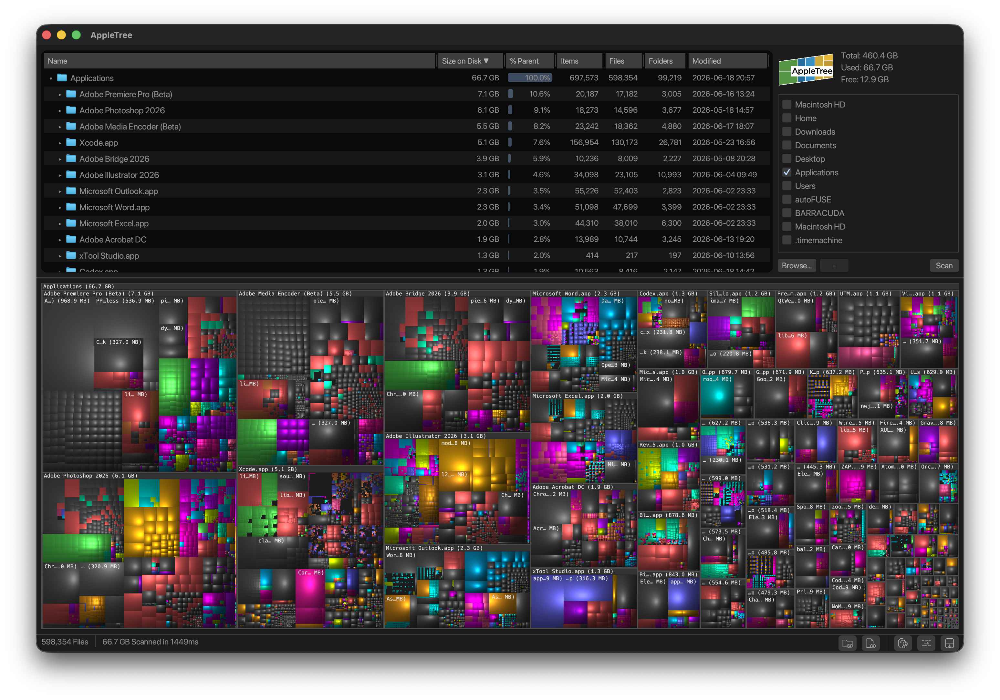

# AppleTree

A disk usage visualizer for macOS, inspired by [WinDirStat](https://windirstat.net/) and [WizTree](https://diskanalyzer.com/). I loved the functionality of these tools but was never really satisfied with the alternatives available on macOS, so I built my own.

## Features

- **Treemap visualization** with cushion shading (matching WinDirStat's look)
- **Directory tree** with collapsible nodes, keyboard navigation, and size annotations
- **Extension-based color coding** that keeps treemap colors stable by file type
- **Fast scanning** using macOS-native `getattrlistbulk` syscall with parallel tree building via rayon
- **Delete files/folders** directly from the UI — ⌘Delete for instant delete, Delete for native macOS confirmation dialog
- **Open any folder** via the File menu, native folder picker on startup, or pass a path on the command line

## Screenshot



## Building

Requires Rust (2024 edition). macOS only — uses platform-specific APIs for fast directory scanning.

```sh
cargo build --release
```

## Packaging

Build a native macOS app bundle:

```sh
scripts/package-macos-app.sh
```

The bundle is written to `target/release/macos/AppleTree.app` and ad-hoc signed
by default. Set `CODESIGN_IDENTITY` to use a Developer ID certificate, or
`CODESIGN=0` to skip signing.

## Usage

```sh
# Launch with folder picker
cargo run --release

# Scan a specific directory
cargo run --release -- /path/to/scan
```

## Benchmarking

```sh
# Scan throughput
cargo run --release --bin bench -- scan "$HOME" --runs 5 --warmups 1

# Table sort cost
cargo run --release --bin bench -- table-sort "$HOME" --sort name --asc

# Treemap layout and cushion render cost
cargo run --release --bin bench -- treemap-render "$HOME" --width 1200 --height 800
```

## How it works

AppleTree scans directories using the macOS `getattrlistbulk` syscall, which retrieves multiple directory entries with their attributes in a single kernel call — avoiding per-file overhead. Directory traversal is parallelized across cores using rayon, with `openat()` for efficient relative path resolution.

The treemap uses squarified layout from the `treemap` crate with cushion-shaded rendering, producing the familiar WinDirStat look where each file is a colored rectangle sized proportionally to its disk usage.

## License

[GPL-3.0](LICENSE)
